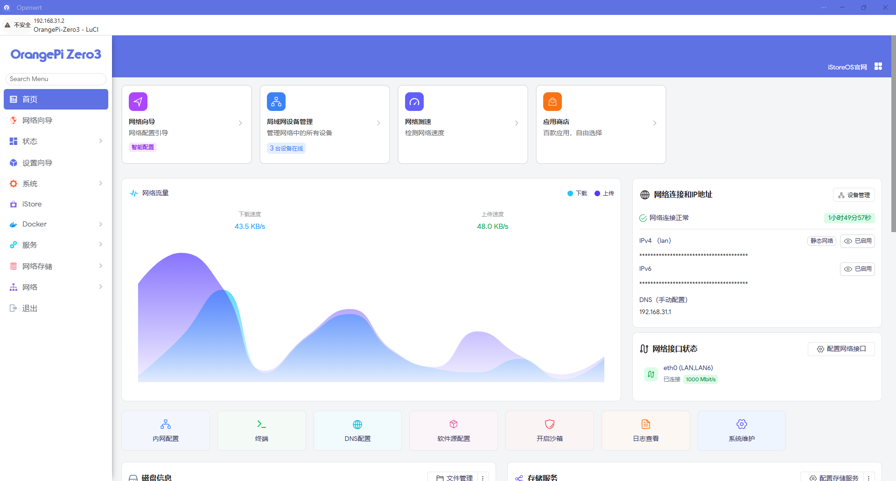
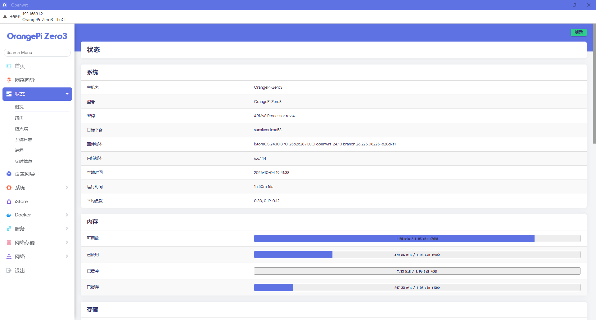
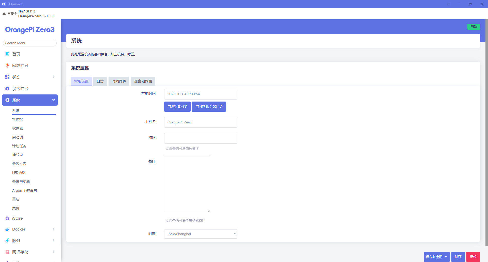
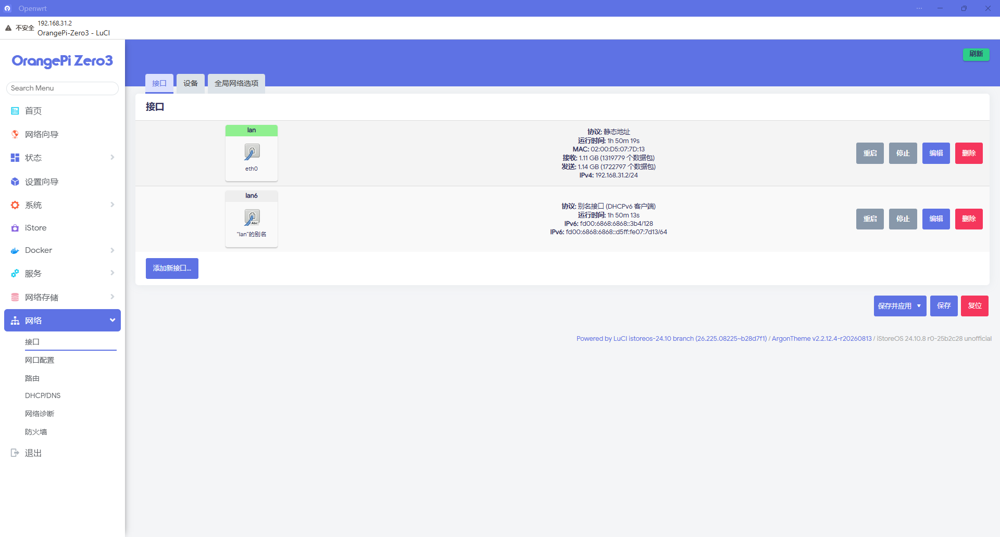
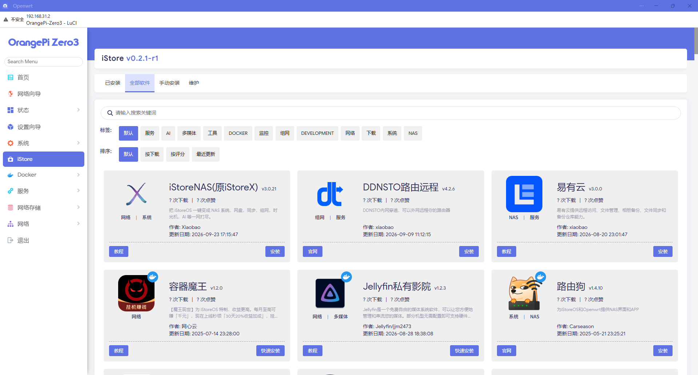

# Orange Pi Zero 3 iStoreOS ImageBuilder

面向 **Orange Pi Zero 3 (Allwinner H618)** 的自用 iStoreOS ImageBuilder。

该 ImageBuilder 基于 iStoreOS 24.10 系列源码制作，针对 Orange Pi Zero 3 完成了启动、YT8531C 千兆网口、三分区 Overlay、旁路由首启配置等适配，并内置当前已验证固件所需的软件包及依赖。

> [!IMPORTANT]
> 本项目不是 Orange Pi 或 iStoreOS 官方项目。当前实机验证设备为 **Orange Pi Zero 3 2GB**。

## 发布信息

| 项目 | 当前版本 |
|---|---|
| Target | `sunxi/cortexa53` |
| Device | `xunlong_orangepi-zero3` |
| SoC | Allwinner H618 |
| Architecture | AArch64 / Cortex-A53 |
| Kernel | Linux 6.6.144 |
| Source branch | `orangepi-zero3` |
| Source revision | `r0-25b2c28` |
| ImageBuilder 类型 | Lite / Standalone |
| 显式默认包 | 157 |
| Lite 本地 IPK | 314 |
| ImageBuilder 压缩包 | `istoreos-imagebuilder-orangepi-zero3-lite-r0-25b2c28.tar.zst` |
| 压缩包大小 | 约 176 MiB |
| ImageBuilder SHA256 | `51164e2ed0004abbeda4cbc1fbbfa646dd21535e111a91c515bbab5b5645c453` |
| 默认固件 Manifest SHA256 | `dd94db30b8962143ff0239be76462e32d959780970a5998ecc4d0ee53d3b6005` |

## 主要功能

| 类别 | 默认内容 |
|---|---|
| Web 管理 | iStoreOS / LuCI、中文界面、Argon、QuickStart、网络向导 |
| 代理 | OpenClash + Mihomo Core |
| 容器 | Docker、dockerd、Docker Compose、Dockerman |
| 远程访问 | Tailscale 后台程序 |
| 存储 | 分区扩容、Btrfs/F2FS/EXT4 相关工具 |
| 系统工具 | ttyd、关机、htop、smartmontools、wget-ssl 等 |
| DNS / DHCP | `dnsmasq-full` |
| 网口 | YT8531C 1Gbps Full Duplex 已实机验证 |
| 启动 | Orange Pi Zero 3 U-Boot / DTB / Kernel 已预置 |

Tailscale 当前提供后台程序，**未集成第三方 Tailscale LuCI 社区界面**。

## Orange Pi Zero 3 专项适配

本项目当前包含以下 Zero 3 专项调整：

- YT8531C PHY 稳定性适配；
- SPI0 默认禁用；
- SD 卡三分区布局；
- p2 使用只读 SquashFS；
- p3 使用约 2 GiB 的可写 Overlay；
- 单网口旁路由首启配置；
- `eth0` 首次启动默认通过上级路由 DHCP 获取地址；
- 默认关闭 LAN DHCP / DHCPv6 / RA / NDP 服务，避免影响现有主局域网。

磁盘布局：

```text
p1  FAT Boot
p2  SquashFS rootfs   512 MiB
p3  writable Overlay  2048 MiB
```

## 下载与校验

请从仓库的 **Releases** 页面下载：

```text
istoreos-imagebuilder-orangepi-zero3-lite-r0-25b2c28.tar.zst
istoreos-imagebuilder-orangepi-zero3-lite-r0-25b2c28.tar.zst.sha256
```

校验：

```bash
sha256sum -c istoreos-imagebuilder-orangepi-zero3-lite-r0-25b2c28.tar.zst.sha256
```

当前发布包 SHA256：

```text
51164e2ed0004abbeda4cbc1fbbfa646dd21535e111a91c515bbab5b5645c453
```

## 使用方法

要求一台 **x86_64 Linux** 主机。已验证：

- Ubuntu 24.04 x86_64
- fnOS x86_64

准备基本工具：

```bash
sudo apt update
sudo apt install -y make tar zstd
```

解压：

```bash
tar --zstd -xf istoreos-imagebuilder-orangepi-zero3-lite-r0-25b2c28.tar.zst
cd imagebuilder-zero3-lite
```

直接构建默认固件：

```bash
make image
```

输出目录：

```text
bin/targets/sunxi/cortexa53/
```

主要固件：

```text
istoreos-sunxi-cortexa53-xunlong_orangepi-zero3-squashfs-sdcard.img.gz
```

查看默认固件软件包：

```bash
make manifest
```

## 自定义软件包

默认构建已经包含当前实机验证固件所需的软件包及依赖。

在现有默认配置基础上添加包：

```bash
make image PACKAGES="pkg1 pkg2"
```

删除默认包：

```bash
make image PACKAGES="-pkgname"
```

> [!NOTE]
> Lite 版只保留当前默认固件所需的 **314 个本地 IPK**。如果要添加 Lite 包仓库中不存在的软件包，请使用完整版 ImageBuilder 或自行重新生成包含对应 IPK 的 ImageBuilder。

## 自定义 FILES

默认构建会使用项目自带的 `default-files/`：

```text
default-files/
├── etc/openclash/core/clash_meta
└── etc/uci-defaults/99-bypass-router
```

如果指定：

```bash
make image FILES="/path/to/files"
```

则会使用你指定的 FILES 目录。若仍希望保留 Mihomo Core 和默认旁路由配置，请先将自己的文件与 `default-files/` 合并。

## 默认网络行为

首次启动后，Orange Pi Zero 3 默认作为单网口旁路由接入现有局域网：

```text
Main Router
    │
    └── Orange Pi Zero 3 / eth0
          ├── DHCP Client
          ├── iStoreOS / LuCI
          ├── OpenClash
          ├── Docker
          └── Tailscale
```

设备默认**不会向上级 LAN 提供 DHCP 服务**。管理地址请在主路由 DHCP 客户端列表中查找 `OrangePi-Zero3`。

## 管理界面截图

### iStoreOS 首页



### 状态页面



### 系统页面



### 网络页面



### iStore / 应用



> 上传截图前建议隐藏公网 IP、MAC、Tailscale 地址、订阅地址、代理节点名称及其他个人信息。

## 构建一致性说明

相同 ImageBuilder 在不同 Linux 主机上构建时：

- 默认软件包 Manifest 可以完全一致；
- 文件内容和功能可以一致；
- 最终 `.img.gz` 的 SHA256 **可能不同**。

当前已确认差异来源于 SquashFS superblock 的 `mkfs_time` 构建时间字段，该差异不影响固件功能。

当前已验证的默认 Manifest SHA256：

```text
dd94db30b8962143ff0239be76462e32d959780970a5998ecc4d0ee53d3b6005
```

## 源码与构建来源

本 ImageBuilder 对应的源码适配仓库：

https://github.com/longtianhgg/orangepi-zero3-istoreos

对应分支：

```text
orangepi-zero3
```

对应源码提交：

```text
25b2c2872e6c2dbcad32b5b1a50fff26299d7cbf
```

ImageBuilder revision：

```text
r0-25b2c28
```

## 已验证状态

当前版本已完成以下实机验证：

- Orange Pi Zero 3 正常启动；
- YT8531C 千兆网口 Link Up；
- 1 Gbps Full Duplex；
- SquashFS 根文件系统正常；
- 独立 Overlay 正常初始化和挂载；
- LuCI / iStoreOS 管理界面正常；
- 中文界面正常；
- 网络向导正常；
- 单网口旁路由工作正常；
- OpenClash + Mihomo 正常；
- Docker / Dockerman 正常；
- Tailscale 后台程序正常；
- `make image` 在 Ubuntu 与 fnOS x86_64 环境验证通过。

## 许可证与第三方组件

本项目基于 OpenWrt、iStoreOS 以及多个第三方开源项目。

仓库中的修改代码、构建脚本、二进制软件包及第三方组件分别遵循其原始许可证。仓库顶层许可证不会覆盖或重新许可第三方组件。

发布包含第三方二进制文件的 ImageBuilder 时，请同时保留对应许可证信息，并确保满足相关开源许可证对源码提供、版权声明和许可证文本的要求。

详见 [NOTICE.md](NOTICE.md)。

## 致谢

感谢 OpenWrt、iStoreOS、LuCI、OpenClash、Mihomo、Docker、Tailscale 及相关开源项目和社区。
